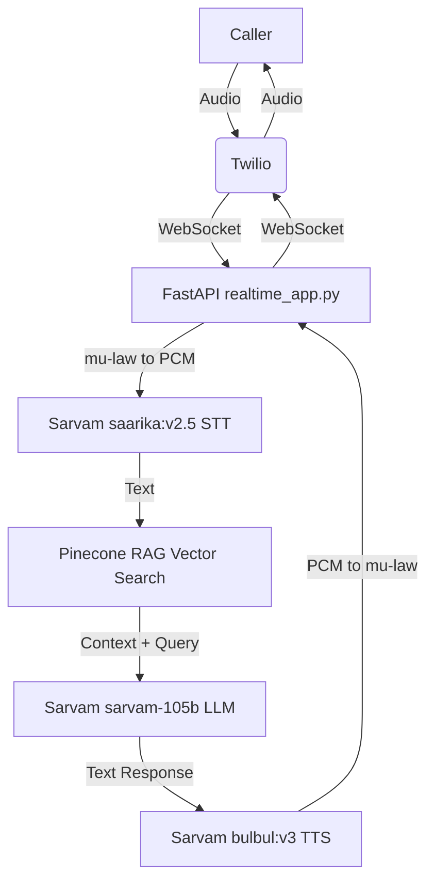

# Architecture

## Data Flow

## Key Components
1. **Twilio Media Streams**: Handles the telephony side, routing phone calls to our WebSocket server.
2. **FastAPI Application**: The core orchestrator. Manages WebSocket connections and parallel processing tasks.
3. **Audio Utils**: Converts Twilio's mu-law audio to standard PCM format for Sarvam using FFmpeg.
4. **Pinecone**: Acts as the memory bank, providing relevant hospital documentation for RAG.
5. **MongoDB/Google Sheets**: Stores generated actions such as appointment bookings.
